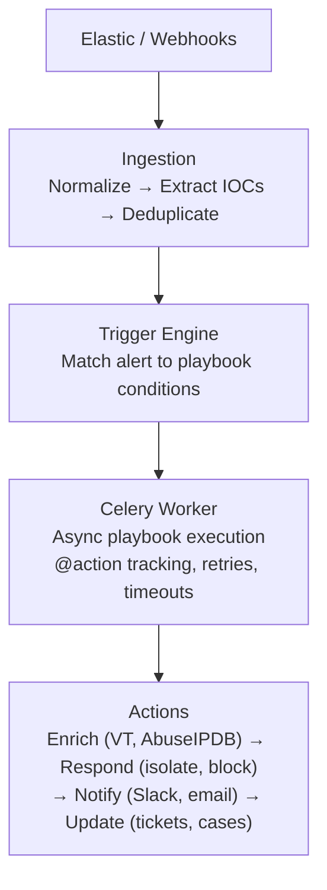

<p align="center">
  
</p>

<h1 align="center">OpenSOAR</h1>
<p align="center"><strong>Open-source SOAR platform. Write security automation in Python, not YAML.</strong></p>

<p align="center">
  <a href="https://github.com/opensoar-hq/opensoar-core/actions/workflows/build.yml"></a>
  <a href="LICENSE"></a>
  <a href="https://github.com/opensoar-hq/opensoar-core/stargazers"></a>
  <a href="https://ghcr.io/opensoar-hq/opensoar-core"></a>
</p>

---

OpenSOAR is the orchestration and automation layer for the modern SOC. It sits between your SIEM (Elastic, Splunk) and your response tools, letting you write automation logic in plain Python — no sandboxes, no per-action billing, no vendor lock-in.

Built for IR analysts and MSSPs. Dark-themed, fast, opinionated.

**Get running in 30 seconds:**

```bash
git clone https://github.com/opensoar-hq/opensoar-core.git && cd opensoar-core && docker compose up -d
```

Then open [http://localhost:3000](http://localhost:3000).

---

## Why OpenSOAR?

| | **OpenSOAR** | Shuffle SOAR | Tines | Palo Alto XSOAR |
|---|---|---|---|---|
| License | Apache 2.0 | AGPL-3.0 | Proprietary | Proprietary |
| Automation language | Python (async) | Visual/JSON | Visual builder | YAML + Python |
| Per-action billing | No | No | Yes | Yes |
| Self-hosted | Yes | Yes | No | On-prem option |
| Built-in AI | Yes (free) | No | Paid add-on | Paid add-on |
| Playbook style | Code-first | Drag-and-drop | Drag-and-drop | Mixed |

---

## Features

- [x] **Webhook ingestion** — automatic normalization (Elastic, generic JSON), IOC extraction, deduplication
- [x] **Python-native playbooks** — `@playbook` and `@action` decorators, `asyncio.gather()` for parallelism, retry/timeout per action
- [x] **Trigger engine** — match alerts to playbooks by severity, source, or field conditions
- [x] **Integrations** — Elastic Security, VirusTotal, AbuseIPDB, Slack, Email, extensible via Python SDK
- [x] **Case management** — incidents, observables, correlation suggestions
- [x] **AI-powered** — LLM summarization, triage recommendations, playbook generation, auto-resolve, correlation (Claude, OpenAI, Ollama)
- [x] **Dashboard & UI** — React 19, dark theme, priority queue, MTTR, per-partner MSSP stats
- [x] **Auth & RBAC** — JWT + API keys, 3 roles, 15 permissions
- [x] **Celery workers** — async execution with horizontal scaling
- [x] **Plugin architecture** — load optional enterprise features if installed

---

## Quick Start

```bash
# Clone and start
git clone https://github.com/opensoar-hq/opensoar-core.git
cd opensoar-core
docker compose up -d

# Send a test alert
curl -X POST http://localhost:8000/api/v1/webhooks/alerts \
  -H "Content-Type: application/json" \
  -d '{
    "rule_name": "Brute Force Detected",
    "severity": "high",
    "source_ip": "203.0.113.42",
    "hostname": "web-prod-01",
    "tags": ["authentication", "brute-force"]
  }'

# Open the UI
open http://localhost:3000
```

---

## Example Playbook

```python
from opensoar import playbook, action, Alert
import asyncio

@playbook(trigger="webhook", conditions={"severity": ["high", "critical"]})
async def triage_high_severity(alert: Alert):
    # Enrich in parallel
    vt_result, abuse_result = await asyncio.gather(
        lookup_virustotal(alert.iocs),
        lookup_abuseipdb(alert.source_ip),
    )

    if abuse_result.confidence_score > 80:
        await isolate_host(alert.hostname)
        await notify_slack(
            channel="#soc-critical",
            message=f"🚨 {alert.title} — host isolated, VT: {vt_result.positives}/{vt_result.total}"
        )
    else:
        await alert.update(determination="benign", status="resolved")
```

No DSL. No YAML. Just Python.

---

## Architecture



**Stack**: Python 3.12, FastAPI, SQLAlchemy (async), PostgreSQL, Redis, Celery, React 19, Vite

---

## Project Structure

```
opensoar/
├── src/opensoar/
│   ├── api/            # FastAPI endpoints (alerts, playbooks, runs, dashboard)
│   ├── auth/           # JWT + API key authentication
│   ├── core/           # Playbook engine, triggers, executor, registry
│   ├── ingestion/      # Alert normalization, webhook processing
│   ├── integrations/   # Elastic, VirusTotal, AbuseIPDB, Slack, Email
│   ├── models/         # SQLAlchemy models
│   ├── schemas/        # Pydantic v2 request/response schemas
│   └── worker/         # Celery tasks
├── ui/                 # React frontend
├── migrations/         # Alembic database migrations
├── playbooks/          # Example playbooks
├── docker-compose.yml  # Full stack: API + worker + PostgreSQL + Redis
└── Dockerfile
```

---

## Documentation

- [Architecture](docs/architecture.md) — System design, component breakdown, deployment models
- [Design Decisions](docs/design-decisions.md) — UX and architectural rationale
- [Repository Structure](docs/repository-structure.md) — Multi-repo layout

---

## Roadmap

| Phase | Status | Focus |
|-------|--------|-------|
| Core Platform | ✅ | Alert management, playbook engine, API, React UI |
| Quality + Ops | ✅ | 168 tests, CI pipeline, webhook auth, rate limiting |
| SDK + Integrations | ✅ | SDK on PyPI, 5 community packs (30 API methods) |
| Case Management | ✅ | Incidents, observables, correlation suggestions |
| AI Features | ✅ | LLM summarization, triage, playbook gen, auto-resolve |
| Enterprise | ✅ | RBAC (3 roles, 15 permissions), plugin architecture |
| Cloud | 📋 | SaaS at opensoar.app |

---

## Contributing

We welcome contributions! See [CONTRIBUTING.md](CONTRIBUTING.md) for guidelines.

Areas where help is most needed:
- **Integrations** — new SIEM normalizers, response tool connectors
- **Playbooks** — community playbook packs for common scenarios
- **Frontend** — dashboard improvements, new visualizations
- **Documentation** — guides, tutorials, deployment recipes

---

## License

Apache 2.0 — Use it commercially, fork it, embed it. No restrictions.
