# Architecture

## Design Principles

1. **Python-native** — Playbook actions are Python functions. No DSL, no sandbox, no restricted stdlib. If you can `pip install` it, you can use it.
2. **SIEM-agnostic** — First-class support for Elastic Security and Wazuh. Pluggable adapter pattern for any SIEM.
3. **Self-hosted first** — Docker Compose for small deployments, Kubernetes for scale.
4. **Developer experience over enterprise features** — Great DX attracts contributors. Enterprise features come from community scale.
5. **Modular and composable** — Clean package boundaries enable splitting into separate repos when needed, not before.

---

## 1. System Overview

All services and how they connect — API server, Celery worker, PostgreSQL, Redis, Elasticsearch, and the React UI.

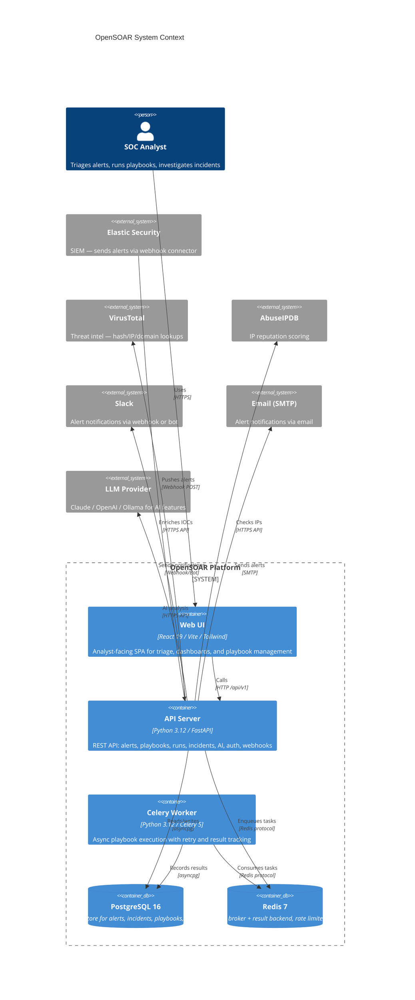
```mermaid
C4Context
    title OpenSOAR System Context

    Person(analyst, "SOC Analyst", "Triages alerts, runs playbooks, investigates incidents")

    System_Boundary(opensoar, "OpenSOAR Platform") {
        Container(ui, "Web UI", "React 19 / Vite / Tailwind", "Analyst-facing SPA for triage, dashboards, and playbook management")
        Container(api, "API Server", "Python 3.12 / FastAPI", "REST API: alerts, playbooks, runs, incidents, AI, auth, webhooks")
        Container(worker, "Celery Worker", "Python 3.12 / Celery 5", "Async playbook execution with retry and result tracking")
        ContainerDb(postgres, "PostgreSQL 16", "Primary datastore for alerts, incidents, playbooks, runs, analysts")
        ContainerDb(redis, "Redis 7", "Celery broker + result backend, rate limiter state")
    }

    System_Ext(elastic, "Elastic Security", "SIEM — sends alerts via webhook connector")
    System_Ext(vt, "VirusTotal", "Threat intel — hash/IP/domain lookups")
    System_Ext(abuseipdb, "AbuseIPDB", "IP reputation scoring")
    System_Ext(slack, "Slack", "Alert notifications via webhook or bot")
    System_Ext(email, "Email (SMTP)", "Alert notifications via email")
    System_Ext(llm, "LLM Provider", "Claude / OpenAI / Ollama for AI features")

    Rel(analyst, ui, "Uses", "HTTPS")
    Rel(ui, api, "Calls", "HTTP /api/v1")
    Rel(api, postgres, "Reads/writes", "asyncpg")
    Rel(api, redis, "Enqueues tasks", "Redis protocol")
    Rel(worker, redis, "Consumes tasks", "Redis protocol")
    Rel(worker, postgres, "Records results", "asyncpg")
    Rel(elastic, api, "Pushes alerts", "Webhook POST")
    Rel(api, vt, "Enriches IOCs", "HTTPS API")
    Rel(api, abuseipdb, "Checks IPs", "HTTPS API")
    Rel(api, slack, "Sends notifications", "Webhook/Bot")
    Rel(api, email, "Sends alerts", "SMTP")
    Rel(api, llm, "AI analysis", "HTTPS API")
```

### Service Map (Docker Compose)

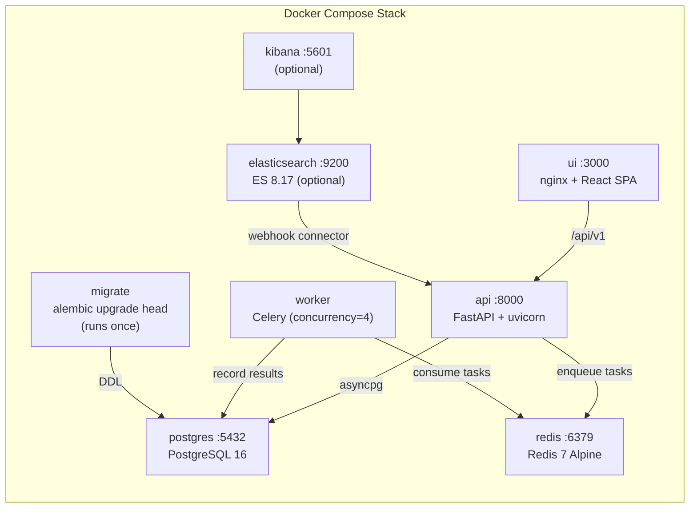
```mermaid
flowchart LR
    subgraph docker["Docker Compose Stack"]
        direction TB
        api["api :8000<br/>FastAPI + uvicorn"]
        worker["worker<br/>Celery (concurrency=4)"]
        ui_svc["ui :3000<br/>nginx + React SPA"]
        pg["postgres :5432<br/>PostgreSQL 16"]
        rd["redis :6379<br/>Redis 7 Alpine"]
        es["elasticsearch :9200<br/>ES 8.17 (optional)"]
        kb["kibana :5601<br/>(optional)"]
        migrate["migrate<br/>alembic upgrade head<br/>(runs once)"]
    end

    api -->|asyncpg| pg
    api -->|enqueue tasks| rd
    worker -->|consume tasks| rd
    worker -->|record results| pg
    ui_svc -->|/api/v1| api
    migrate -->|DDL| pg
    es -->|webhook connector| api
    kb --> es
```

### Startup Sequence

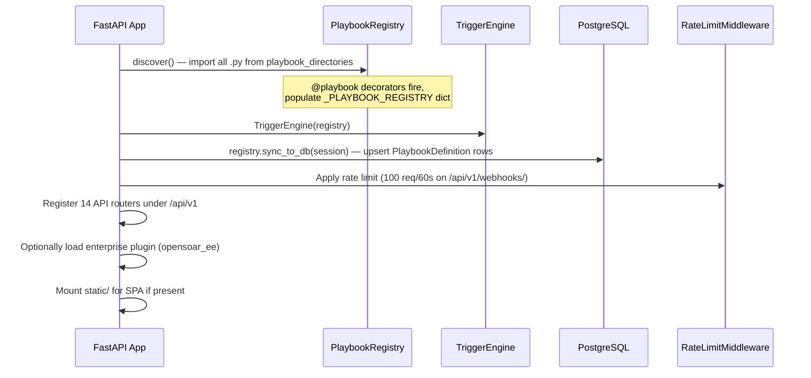
```mermaid
sequenceDiagram
    participant App as FastAPI App
    participant Reg as PlaybookRegistry
    participant TE as TriggerEngine
    participant DB as PostgreSQL
    participant MW as RateLimitMiddleware

    App->>Reg: discover() — import all .py from playbook_directories
    Note over Reg: @playbook decorators fire,<br/>populate _PLAYBOOK_REGISTRY dict
    App->>TE: TriggerEngine(registry)
    App->>DB: registry.sync_to_db(session) — upsert PlaybookDefinition rows
    App->>MW: Apply rate limit (100 req/60s on /api/v1/webhooks/)
    App->>App: Register 14 API routers under /api/v1
    App->>App: Optionally load enterprise plugin (opensoar_ee)
    App->>App: Mount static/ for SPA if present
```

---

## 2. Alert Ingestion Flow

Webhook → normalization → deduplication → trigger matching → playbook dispatch.

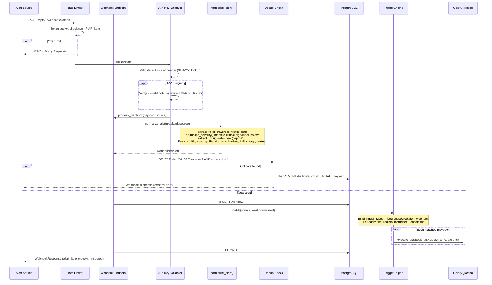
```mermaid
sequenceDiagram
    participant Src as Alert Source
    participant RL as Rate Limiter
    participant WH as Webhook Endpoint
    participant Auth as API Key Validator
    participant Norm as normalize_alert()
    participant Dedup as Dedup Check
    participant DB as PostgreSQL
    participant TE as TriggerEngine
    participant Celery as Celery (Redis)

    Src->>RL: POST /api/v1/webhooks/alerts
    RL->>RL: Token bucket check (per IP/API key)
    alt Over limit
        RL-->>Src: 429 Too Many Requests
    end
    RL->>Auth: Pass through
    Auth->>Auth: Validate X-API-Key header (SHA-256 lookup)
    opt HMAC signing
        Auth->>Auth: Verify X-Webhook-Signature (HMAC-SHA256)
    end
    Auth->>WH: process_webhook(payload, source)

    WH->>Norm: normalize_alert(payload, source)
    Note over Norm: extract_field() traverses nested dicts<br/>normalize_severity() maps to critical/high/medium/low<br/>extract_iocs() walks tree (depth≤10)<br/>Extracts: title, severity, IPs, domains, hashes, URLs, tags, partner

    Norm-->>WH: NormalizedAlert

    WH->>Dedup: SELECT alert WHERE source=? AND source_id=?
    alt Duplicate found
        Dedup->>DB: INCREMENT duplicate_count, UPDATE payload
        Dedup-->>Src: WebhookResponse (existing alert)
    else New alert
        WH->>DB: INSERT Alert row
        WH->>TE: match(source, alert.normalized)
        Note over TE: Build trigger_types = [source, source.alert, webhook]<br/>For each: filter registry by trigger + conditions
        loop Each matched playbook
            TE->>Celery: execute_playbook_task.delay(name, alert_id)
        end
        WH->>DB: COMMIT
        WH-->>Src: WebhookResponse (alert_id, playbooks_triggered)
    end
```

### Normalization Detail

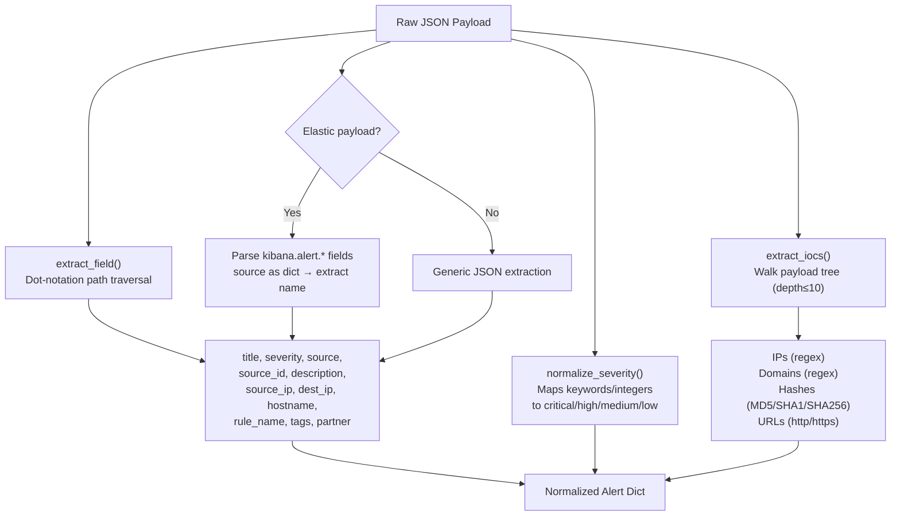
```mermaid
flowchart TD
    payload["Raw JSON Payload"] --> extract["extract_field()<br/>Dot-notation path traversal"]
    extract --> fields["title, severity, source,<br/>source_id, description,<br/>source_ip, dest_ip, hostname,<br/>rule_name, tags, partner"]

    payload --> severity["normalize_severity()<br/>Maps keywords/integers<br/>to critical/high/medium/low"]
    payload --> iocs["extract_iocs()<br/>Walk payload tree (depth≤10)"]
    iocs --> ioc_types["IPs (regex)<br/>Domains (regex)<br/>Hashes (MD5/SHA1/SHA256)<br/>URLs (http/https)"]

    fields --> normalized["Normalized Alert Dict"]
    severity --> normalized
    ioc_types --> normalized

    payload --> elastic_check{"Elastic payload?"}
    elastic_check -->|Yes| elastic_parse["Parse kibana.alert.* fields<br/>source as dict → extract name"]
    elastic_check -->|No| generic_parse["Generic JSON extraction"]
    elastic_parse --> fields
    generic_parse --> fields
```

---

## 3. Playbook Execution Flow

Trigger fires → Celery task enqueued → worker executes playbook → actions tracked → results recorded.

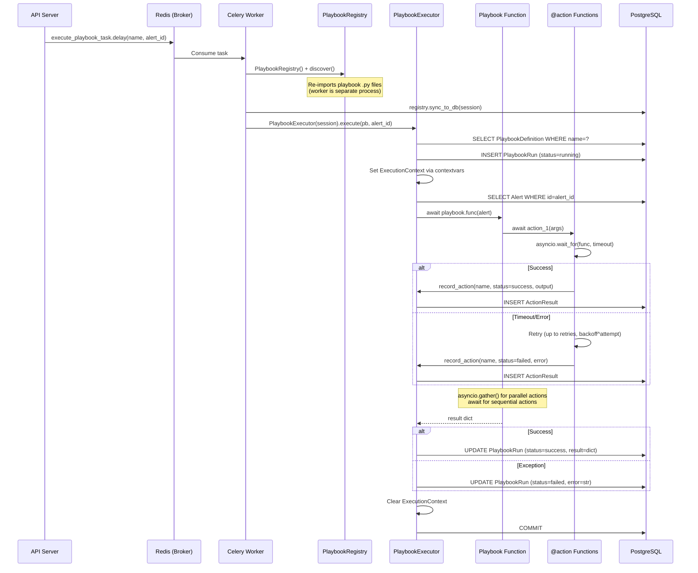
```mermaid
sequenceDiagram
    participant API as API Server
    participant Redis as Redis (Broker)
    participant Worker as Celery Worker
    participant Reg as PlaybookRegistry
    participant Exec as PlaybookExecutor
    participant PB as Playbook Function
    participant Act as @action Functions
    participant DB as PostgreSQL

    API->>Redis: execute_playbook_task.delay(name, alert_id)

    Redis->>Worker: Consume task
    Worker->>Reg: PlaybookRegistry() + discover()
    Note over Reg: Re-imports playbook .py files<br/>(worker is separate process)
    Worker->>DB: registry.sync_to_db(session)
    Worker->>Exec: PlaybookExecutor(session).execute(pb, alert_id)

    Exec->>DB: SELECT PlaybookDefinition WHERE name=?
    Exec->>DB: INSERT PlaybookRun (status=running)
    Exec->>Exec: Set ExecutionContext via contextvars
    Exec->>DB: SELECT Alert WHERE id=alert_id
    Exec->>PB: await playbook.func(alert)

    PB->>Act: await action_1(args)
    Act->>Act: asyncio.wait_for(func, timeout)
    alt Success
        Act->>Exec: record_action(name, status=success, output)
        Exec->>DB: INSERT ActionResult
    else Timeout/Error
        Act->>Act: Retry (up to retries, backoff^attempt)
        Act->>Exec: record_action(name, status=failed, error)
        Exec->>DB: INSERT ActionResult
    end

    Note over PB: asyncio.gather() for parallel actions<br/>await for sequential actions

    PB-->>Exec: result dict

    alt Success
        Exec->>DB: UPDATE PlaybookRun (status=success, result=dict)
    else Exception
        Exec->>DB: UPDATE PlaybookRun (status=failed, error=str)
    end
    Exec->>Exec: Clear ExecutionContext
    Exec->>DB: COMMIT
```

### Action Decorator Internals

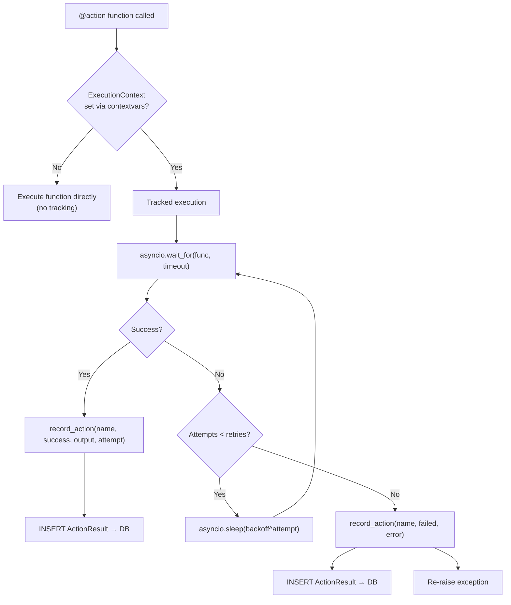
```mermaid
flowchart TD
    call["@action function called"] --> ctx_check{"ExecutionContext<br/>set via contextvars?"}
    ctx_check -->|No| direct["Execute function directly<br/>(no tracking)"]
    ctx_check -->|Yes| tracked["Tracked execution"]

    tracked --> wait_for["asyncio.wait_for(func, timeout)"]
    wait_for --> success{"Success?"}

    success -->|Yes| record_ok["record_action(name, success, output, attempt)"]
    record_ok --> db_ok["INSERT ActionResult → DB"]

    success -->|No| retry_check{"Attempts < retries?"}
    retry_check -->|Yes| backoff["asyncio.sleep(backoff^attempt)"]
    backoff --> wait_for
    retry_check -->|No| record_fail["record_action(name, failed, error)"]
    record_fail --> db_fail["INSERT ActionResult → DB"]
    record_fail --> raise["Re-raise exception"]
```

### Playbook Discovery

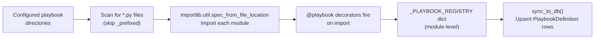
```mermaid
flowchart LR
    dirs["Configured playbook<br/>directories"] --> scan["Scan for *.py files<br/>(skip _prefixed)"]
    scan --> import["importlib.util.spec_from_file_location<br/>Import each module"]
    import --> decorators["@playbook decorators fire<br/>on import"]
    decorators --> registry["_PLAYBOOK_REGISTRY dict<br/>(module-level)"]
    registry --> sync["sync_to_db()<br/>Upsert PlaybookDefinition rows"]
```

---

## 4. Authentication Flow

JWT for UI sessions, API keys for integrations/webhooks, RBAC for authorization.

### JWT Login Flow

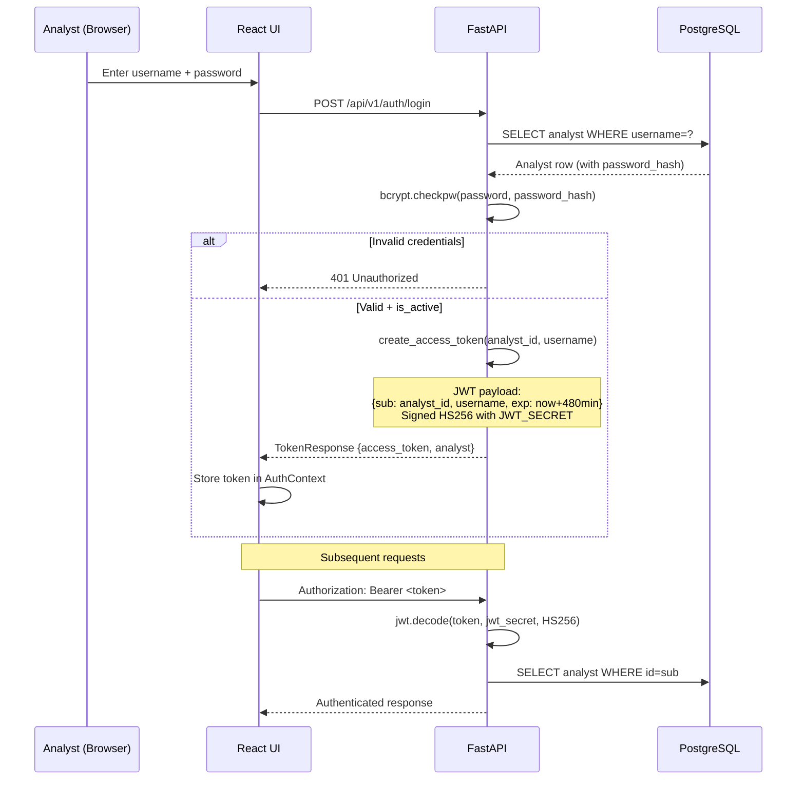
```mermaid
sequenceDiagram
    participant User as Analyst (Browser)
    participant UI as React UI
    participant API as FastAPI
    participant DB as PostgreSQL

    User->>UI: Enter username + password
    UI->>API: POST /api/v1/auth/login

    API->>DB: SELECT analyst WHERE username=?
    DB-->>API: Analyst row (with password_hash)
    API->>API: bcrypt.checkpw(password, password_hash)
    alt Invalid credentials
        API-->>UI: 401 Unauthorized
    else Valid + is_active
        API->>API: create_access_token(analyst_id, username)
        Note over API: JWT payload:<br/>{sub: analyst_id, username, exp: now+480min}<br/>Signed HS256 with JWT_SECRET
        API-->>UI: TokenResponse {access_token, analyst}
        UI->>UI: Store token in AuthContext
    end

    Note over UI,API: Subsequent requests
    UI->>API: Authorization: Bearer <token>
    API->>API: jwt.decode(token, jwt_secret, HS256)
    API->>DB: SELECT analyst WHERE id=sub
    API-->>UI: Authenticated response
```

### API Key Authentication (Webhooks)

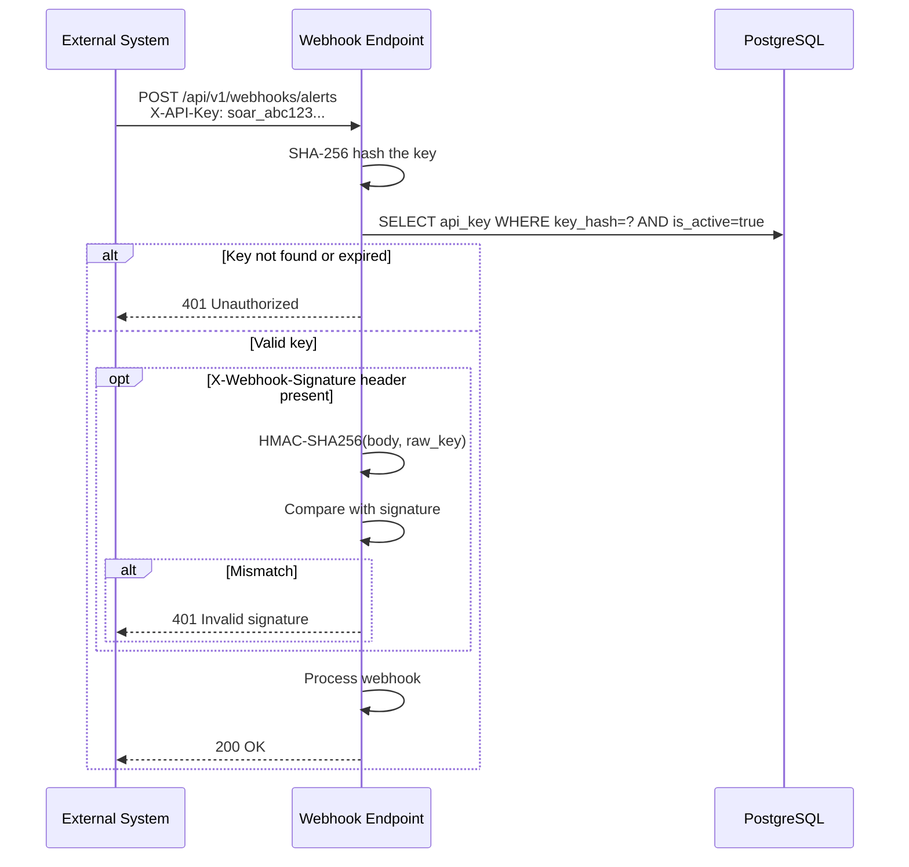
```mermaid
sequenceDiagram
    participant Ext as External System
    participant API as Webhook Endpoint
    participant DB as PostgreSQL

    Ext->>API: POST /api/v1/webhooks/alerts<br/>X-API-Key: soar_abc123...

    API->>API: SHA-256 hash the key
    API->>DB: SELECT api_key WHERE key_hash=? AND is_active=true
    alt Key not found or expired
        API-->>Ext: 401 Unauthorized
    else Valid key
        opt X-Webhook-Signature header present
            API->>API: HMAC-SHA256(body, raw_key)
            API->>API: Compare with signature
            alt Mismatch
                API-->>Ext: 401 Invalid signature
            end
        end
        API->>API: Process webhook
        API-->>Ext: 200 OK
    end
```

### API Key Format

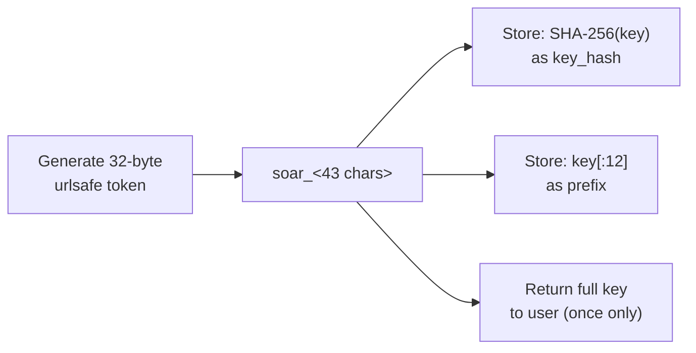
```mermaid
flowchart LR
    gen["Generate 32-byte<br/>urlsafe token"] --> key["soar_<43 chars>"]
    key --> store_hash["Store: SHA-256(key)<br/>as key_hash"]
    key --> store_prefix["Store: key[:12]<br/>as prefix"]
    key --> return["Return full key<br/>to user (once only)"]
```

### RBAC Model

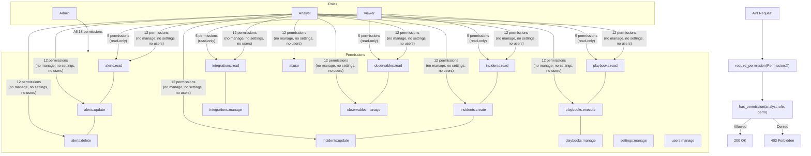
```mermaid
flowchart TD
    subgraph Roles
        admin["Admin"]
        analyst_role["Analyst"]
        viewer["Viewer"]
    end

    subgraph Permissions
        direction LR
        ar["alerts:read"] --- au["alerts:update"] --- ad["alerts:delete"]
        ir["incidents:read"] --- ic["incidents:create"] --- iu["incidents:update"]
        pr["playbooks:read"] --- pe["playbooks:execute"] --- pm["playbooks:manage"]
        intr["integrations:read"] --- intm["integrations:manage"]
        or["observables:read"] --- om["observables:manage"]
        ai["ai:use"]
        sm["settings:manage"]
        um["users:manage"]
    end

    admin -->|"All 18 permissions"| Permissions
    analyst_role -->|"12 permissions<br/>(no manage, no settings, no users)"| ar & au & ad & ir & ic & iu & pr & pe & intr & or & om & ai
    viewer -->|"5 permissions<br/>(read-only)"| ar & ir & pr & intr & or

    req["API Request"] --> dep["require_permission(Permission.X)"]
    dep --> check["has_permission(analyst.role, perm)"]
    check -->|Allowed| proceed["200 OK"]
    check -->|Denied| forbidden["403 Forbidden"]
```

---

## 5. AI Pipeline Flow

Alert analysis via LLM — summarization, triage, playbook generation, auto-resolve, and correlation.

### LLM Provider Selection

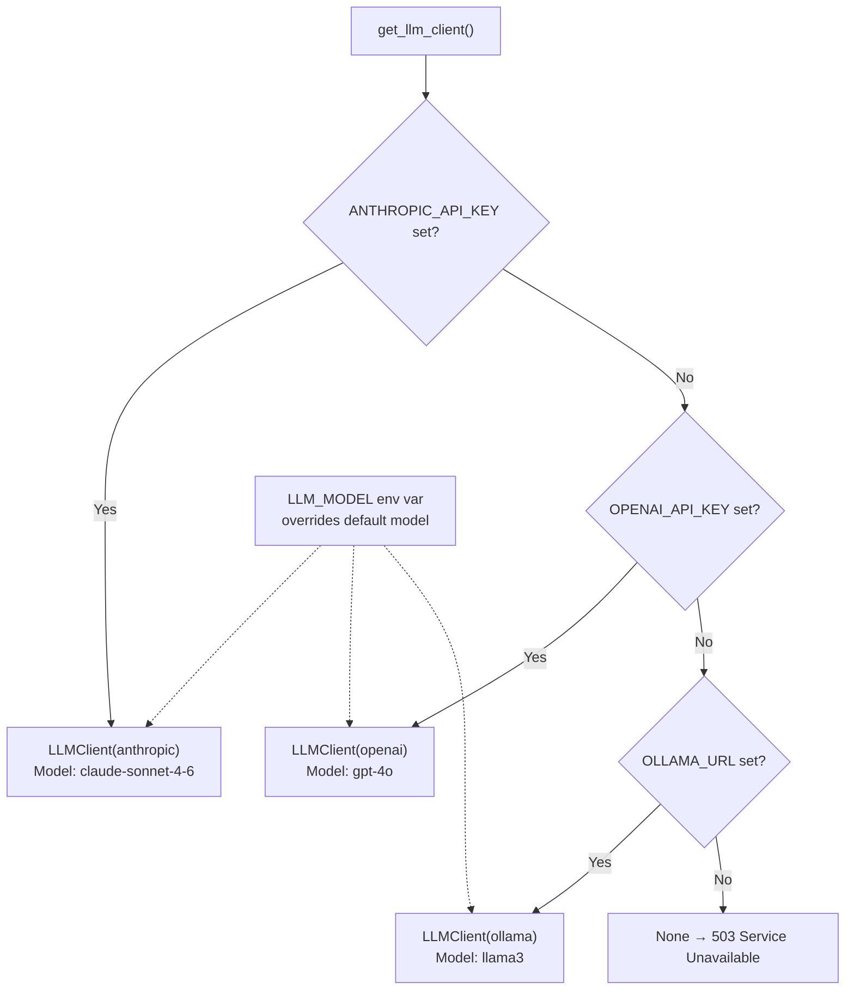
```mermaid
flowchart TD
    start["get_llm_client()"] --> anthropic{"ANTHROPIC_API_KEY set?"}
    anthropic -->|Yes| claude["LLMClient(anthropic)<br/>Model: claude-sonnet-4-6"]
    anthropic -->|No| openai{"OPENAI_API_KEY set?"}
    openai -->|Yes| gpt["LLMClient(openai)<br/>Model: gpt-4o"]
    openai -->|No| ollama{"OLLAMA_URL set?"}
    ollama -->|Yes| local["LLMClient(ollama)<br/>Model: llama3"]
    ollama -->|No| none["None → 503 Service Unavailable"]

    note["LLM_MODEL env var<br/>overrides default model"] -.-> claude & gpt & local
```

### AI Endpoint Flows

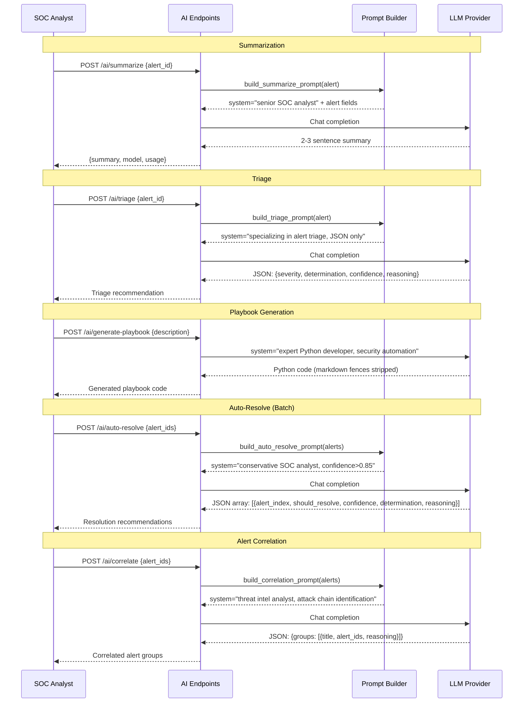
```mermaid
sequenceDiagram
    participant Analyst as SOC Analyst
    participant API as AI Endpoints
    participant Prompts as Prompt Builder
    participant LLM as LLM Provider

    Note over Analyst,LLM: Summarization
    Analyst->>API: POST /ai/summarize {alert_id}
    API->>Prompts: build_summarize_prompt(alert)
    Prompts-->>API: system="senior SOC analyst" + alert fields
    API->>LLM: Chat completion
    LLM-->>API: 2-3 sentence summary
    API-->>Analyst: {summary, model, usage}

    Note over Analyst,LLM: Triage
    Analyst->>API: POST /ai/triage {alert_id}
    API->>Prompts: build_triage_prompt(alert)
    Prompts-->>API: system="specializing in alert triage, JSON only"
    API->>LLM: Chat completion
    LLM-->>API: JSON: {severity, determination, confidence, reasoning}
    API-->>Analyst: Triage recommendation

    Note over Analyst,LLM: Playbook Generation
    Analyst->>API: POST /ai/generate-playbook {description}
    API->>LLM: system="expert Python developer, security automation"
    LLM-->>API: Python code (markdown fences stripped)
    API-->>Analyst: Generated playbook code

    Note over Analyst,LLM: Auto-Resolve (Batch)
    Analyst->>API: POST /ai/auto-resolve {alert_ids}
    API->>Prompts: build_auto_resolve_prompt(alerts)
    Prompts-->>API: system="conservative SOC analyst, confidence>0.85"
    API->>LLM: Chat completion
    LLM-->>API: JSON array: [{alert_index, should_resolve, confidence, determination, reasoning}]
    API-->>Analyst: Resolution recommendations

    Note over Analyst,LLM: Alert Correlation
    Analyst->>API: POST /ai/correlate {alert_ids}
    API->>Prompts: build_correlation_prompt(alerts)
    Prompts-->>API: system="threat intel analyst, attack chain identification"
    API->>LLM: Chat completion
    LLM-->>API: JSON: {groups: [{title, alert_ids, reasoning}]}
    API-->>Analyst: Correlated alert groups
```

### LLM Client — Provider API Differences

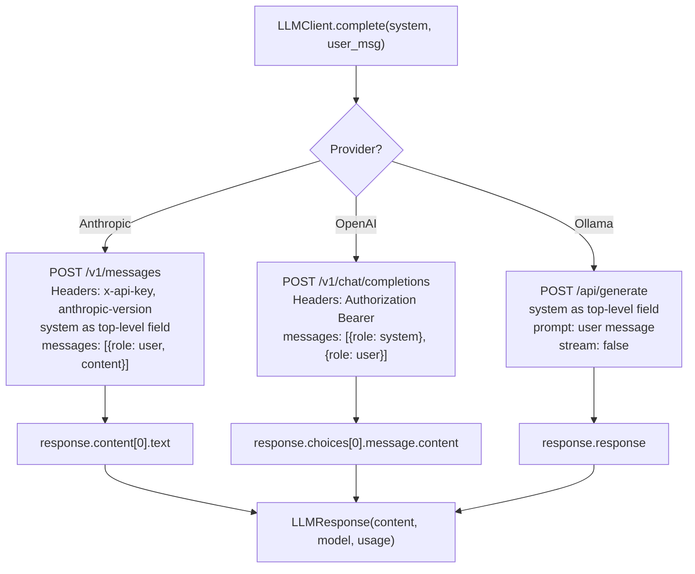
```mermaid
flowchart TD
    client["LLMClient.complete(system, user_msg)"] --> provider{"Provider?"}

    provider -->|Anthropic| anth["POST /v1/messages<br/>Headers: x-api-key, anthropic-version<br/>system as top-level field<br/>messages: [{role: user, content}]"]
    provider -->|OpenAI| oai["POST /v1/chat/completions<br/>Headers: Authorization Bearer<br/>messages: [{role: system}, {role: user}]"]
    provider -->|Ollama| oll["POST /api/generate<br/>system as top-level field<br/>prompt: user message<br/>stream: false"]

    anth --> resp_a["response.content[0].text"]
    oai --> resp_o["response.choices[0].message.content"]
    oll --> resp_l["response.response"]

    resp_a & resp_o & resp_l --> result["LLMResponse(content, model, usage)"]
```

---

## 6. Integration Flow

How external tools connect via the adapter pattern — discovery, configuration, health checks, and execution.

### Integration Adapter Pattern

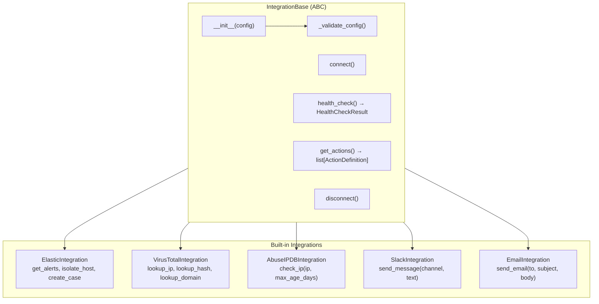
```mermaid
flowchart TD
    subgraph base["IntegrationBase (ABC)"]
        direction LR
        init["__init__(config)"] --> validate["_validate_config()"]
        connect["connect()"]
        health["health_check() → HealthCheckResult"]
        actions["get_actions() → list[ActionDefinition]"]
        disconnect["disconnect()"]
    end

    subgraph builtin["Built-in Integrations"]
        elastic["ElasticIntegration<br/>get_alerts, isolate_host, create_case"]
        vt["VirusTotalIntegration<br/>lookup_ip, lookup_hash, lookup_domain"]
        abuse["AbuseIPDBIntegration<br/>check_ip(ip, max_age_days)"]
        slack_int["SlackIntegration<br/>send_message(channel, text)"]
        email_int["EmailIntegration<br/>send_email(to, subject, body)"]
    end

    base --> elastic & vt & abuse & slack_int & email_int
```

### Integration Discovery and Loading

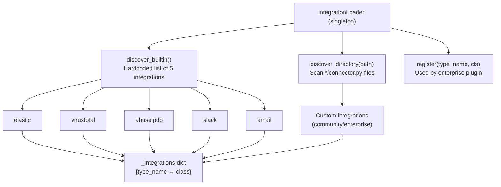
```mermaid
flowchart TD
    loader["IntegrationLoader (singleton)"]

    loader --> builtin["discover_builtin()<br/>Hardcoded list of 5 integrations"]
    builtin --> elastic & vt & abuse & slack & email_mod

    loader --> directory["discover_directory(path)<br/>Scan */connector.py files"]
    directory --> custom["Custom integrations<br/>(community/enterprise)"]

    loader --> manual["register(type_name, cls)<br/>Used by enterprise plugin"]

    elastic["elastic"] & vt["virustotal"] & abuse["abuseipdb"] & slack["slack"] & email_mod["email"] & custom --> registry_map["_integrations dict<br/>{type_name → class}"]
```

### Integration Lifecycle (via API)

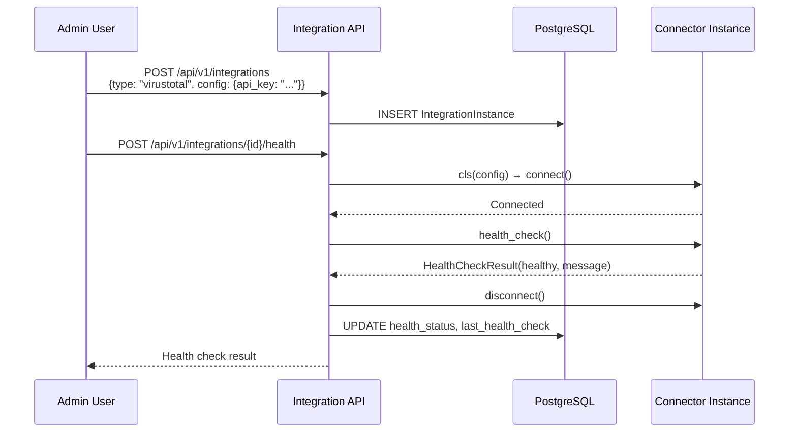
```mermaid
sequenceDiagram
    participant Admin as Admin User
    participant API as Integration API
    participant DB as PostgreSQL
    participant Conn as Connector Instance

    Admin->>API: POST /api/v1/integrations<br/>{type: "virustotal", config: {api_key: "..."}}
    API->>DB: INSERT IntegrationInstance

    Admin->>API: POST /api/v1/integrations/{id}/health
    API->>Conn: cls(config) → connect()
    Conn-->>API: Connected
    API->>Conn: health_check()
    Conn-->>API: HealthCheckResult(healthy, message)
    API->>Conn: disconnect()
    API->>DB: UPDATE health_status, last_health_check
    API-->>Admin: Health check result
```

### Manual Action Execution

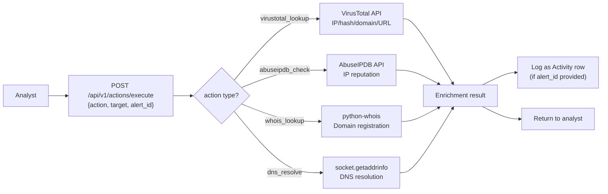
```mermaid
flowchart LR
    analyst["Analyst"] --> execute["POST /api/v1/actions/execute<br/>{action, target, alert_id}"]

    execute --> router{"action type?"}
    router -->|virustotal_lookup| vt_call["VirusTotal API<br/>IP/hash/domain/URL"]
    router -->|abuseipdb_check| abuse_call["AbuseIPDB API<br/>IP reputation"]
    router -->|whois_lookup| whois_call["python-whois<br/>Domain registration"]
    router -->|dns_resolve| dns_call["socket.getaddrinfo<br/>DNS resolution"]

    vt_call & abuse_call & whois_call & dns_call --> result["Enrichment result"]
    result --> log["Log as Activity row<br/>(if alert_id provided)"]
    result --> response["Return to analyst"]
```

---

## 7. Deployment Architecture

### Docker Build Targets

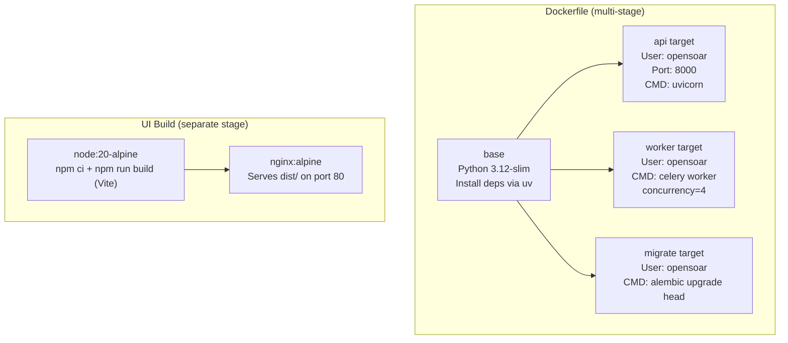
```mermaid
flowchart TD
    subgraph dockerfile["Dockerfile (multi-stage)"]
        base["base<br/>Python 3.12-slim<br/>Install deps via uv"]

        api_target["api target<br/>User: opensoar<br/>Port: 8000<br/>CMD: uvicorn"]
        worker_target["worker target<br/>User: opensoar<br/>CMD: celery worker<br/>concurrency=4"]
        migrate_target["migrate target<br/>User: opensoar<br/>CMD: alembic upgrade head"]

        base --> api_target & worker_target & migrate_target
    end

    subgraph ui_build["UI Build (separate stage)"]
        node_build["node:20-alpine<br/>npm ci + npm run build (Vite)"]
        nginx_runtime["nginx:alpine<br/>Serves dist/ on port 80"]
        node_build --> nginx_runtime
    end
```

### Docker Compose Deployment

```mermaid
flowchart TD
    subgraph compose["docker compose up -d"]
        direction TB

        subgraph infra["Infrastructure"]
            pg["postgres:16<br/>:5433→5432<br/>Volume: pg_data"]
            redis["redis:7-alpine<br/>:6379"]
        end

        subgraph app["Application"]
            api["api :8000<br/>Mounts: ./src, ./playbooks<br/>--reload for hot reload"]
            worker["worker<br/>Mounts: ./src, ./playbooks<br/>Re-imports on each task"]
            ui["ui :3000→80<br/>nginx + React SPA"]
        end

        subgraph optional["Optional (ELK)"]
            es["elasticsearch:8.17<br/>:9200"]
            kibana["kibana:8.17<br/>:5601"]
        end

        subgraph setup["Setup Profile (run-once)"]
            migrate["migrate<br/>alembic upgrade head"]
            elk_setup["elk-setup<br/>Configure Kibana<br/>webhook connector"]
        end
    end

    api --> pg & redis
    worker --> pg & redis
    migrate --> pg
    es --> api
    elk_setup --> kibana
    kibana --> es

    subgraph production["Production: Single-Container Mode"]
        single["API serves static/<br/>as SPA fallback<br/>(UI built into API image)"]
    end
```

### Deployment Models

| Model | Setup | Scale | Use Case |
|-------|-------|-------|----------|
| **Docker Compose** | `docker compose up -d` | Single node, ~10 analysts, ~1K alerts/day | Dev, small teams |
| **Single Container** | API image with static/ built in | Minimal footprint | Demos, testing |
| **Kubernetes** (planned) | Helm chart, horizontal scaling | HA PostgreSQL, worker pools | Enterprise, MSSPs |
| **Air-gapped** (planned) | Offline container images | File-based threat intel | Gov/mil environments |

---

## 8. Data Model

Entity-relationship diagram of all database tables and their relationships.

```mermaid
erDiagram
    analysts {
        uuid id PK
        string username UK "max 100"
        string display_name "max 255"
        string email "nullable"
        string password_hash "bcrypt"
        boolean is_active "default true"
        string role "admin/analyst/viewer"
        datetime created_at
        datetime updated_at
    }

    api_keys {
        uuid id PK
        string name "max 255"
        string key_hash "SHA-256, 64 chars"
        string prefix "first 12 chars"
        boolean is_active
        datetime last_used_at "nullable"
        datetime expires_at "nullable"
        datetime created_at
        datetime updated_at
    }

    alerts {
        uuid id PK
        string source "elastic/webhook"
        string source_id "nullable, dedup key"
        string title "max 500"
        text description "nullable"
        string severity "critical/high/medium/low"
        string status "new/in_progress/resolved"
        jsonb raw_payload
        jsonb normalized
        string source_ip "nullable"
        string dest_ip "nullable"
        string hostname "nullable"
        string rule_name "nullable"
        jsonb iocs "ips/domains/hashes/urls"
        array tags "nullable"
        string partner "nullable, MSSP tenant"
        string determination "unknown/malicious/suspicious/benign"
        integer duplicate_count "default 1"
        datetime resolved_at "nullable"
        string resolve_reason "nullable"
        uuid assigned_to FK "nullable → analysts.id"
        string assigned_username "nullable, denormalized"
        datetime created_at
        datetime updated_at
    }

    playbook_definitions {
        uuid id PK
        string name UK "max 255"
        text description "nullable"
        string module_path "dotted module name"
        string function_name
        string trigger_type "nullable"
        jsonb trigger_config "conditions dict"
        boolean enabled "default true"
        integer version "default 1"
        datetime created_at
        datetime updated_at
    }

    playbook_runs {
        uuid id PK
        uuid playbook_id FK "→ playbook_definitions.id"
        uuid alert_id FK "nullable → alerts.id"
        string status "pending/running/success/failed/cancelled"
        datetime started_at "nullable"
        datetime finished_at "nullable"
        text error "nullable"
        jsonb result "nullable"
        string celery_task_id "nullable"
        datetime created_at
        datetime updated_at
    }

    action_results {
        uuid id PK
        uuid run_id FK "→ playbook_runs.id"
        string action_name
        string status "success/failed"
        datetime started_at "nullable"
        datetime finished_at "nullable"
        integer duration_ms "nullable"
        jsonb input_data "nullable"
        jsonb output_data "nullable"
        text error "nullable"
        integer attempt "default 1"
        datetime created_at
        datetime updated_at
    }

    incidents {
        uuid id PK
        string title "max 500"
        text description "nullable"
        string severity "critical/high/medium/low"
        string status "open/investigating/closed"
        uuid assigned_to FK "nullable → analysts.id"
        string assigned_username "nullable, denormalized"
        array tags "nullable"
        datetime closed_at "nullable"
        datetime created_at
        datetime updated_at
    }

    incident_alerts {
        uuid id PK
        uuid incident_id FK "→ incidents.id (CASCADE)"
        uuid alert_id FK "→ alerts.id (CASCADE)"
    }

    observables {
        uuid id PK
        string type "ip/domain/hash/url"
        string value "max 1000"
        string source "nullable"
        string enrichment_status "default pending"
        jsonb enrichments "default []"
        array tags "nullable"
        uuid alert_id FK "nullable → alerts.id"
        uuid incident_id FK "nullable → incidents.id"
        datetime created_at
        datetime updated_at
    }

    integration_instances {
        uuid id PK
        string integration_type "elastic/vt/abuseipdb/slack/email"
        string name "max 255"
        jsonb config "credentials and settings"
        boolean enabled "default true"
        string health_status "nullable"
        datetime last_health_check "nullable"
        datetime created_at
        datetime updated_at
    }

    activities {
        uuid id PK
        uuid alert_id FK "→ alerts.id (CASCADE)"
        uuid analyst_id FK "nullable → analysts.id"
        string action "status_change/severity_change/etc"
        text detail "nullable"
        jsonb metadata_json "old/new values"
        string analyst_username "nullable, denormalized"
        datetime created_at
        datetime updated_at
    }

    analysts ||--o{ alerts : "assigned_to"
    analysts ||--o{ incidents : "assigned_to"
    analysts ||--o{ activities : "performed"
    alerts ||--o{ playbook_runs : "triggered"
    alerts ||--o{ incident_alerts : "linked"
    alerts ||--o{ observables : "extracted from"
    alerts ||--o{ activities : "audit trail"
    incidents ||--o{ incident_alerts : "contains"
    incidents ||--o{ observables : "associated"
    playbook_definitions ||--o{ playbook_runs : "executed as"
    playbook_runs ||--o{ action_results : "produced"
```

---

## 9. Observability

### Prometheus Metrics

OpenSOAR exposes a Prometheus scrape endpoint at `GET /metrics` (no `/api/v1`
prefix, no auth, not rate-limited). The endpoint returns the standard
Prometheus text exposition format and is safe to scrape at any interval.

| Metric | Type | Labels | Description |
|--------|------|--------|-------------|
| `opensoar_http_requests_total` | Counter | `method`, `path`, `status` | Every HTTP request handled by the API (the `/metrics` scrape itself is excluded). |
| `opensoar_alerts_ingested_total` | Counter | `source` | Incremented on every webhook alert ingest; `source` is `webhook` or `elastic`. |
| `opensoar_playbook_runs_total` | Counter | `playbook`, `status` | Incremented when a playbook run reaches a terminal state (`success`, `failed`, `cancelled`). |
| `opensoar_playbook_run_duration_seconds` | Histogram | `playbook` | Duration of each playbook run, recorded by `PlaybookExecutor` when the run completes. |

HTTP request recording is handled by `MetricsMiddleware`
(`src/opensoar/middleware/metrics.py`). Alert and playbook metrics are emitted
from the webhook handler and the playbook executor respectively.

```mermaid
flowchart LR
    req["HTTP request"] --> mw["MetricsMiddleware"]
    mw --> handler["Route handler"]
    handler --> resp["Response"]
    mw --> http_counter["opensoar_http_requests_total"]

    webhook["Webhook /alerts"] --> alerts_counter["opensoar_alerts_ingested_total"]
    executor["PlaybookExecutor.execute()"] --> runs_counter["opensoar_playbook_runs_total"]
    executor --> runs_hist["opensoar_playbook_run_duration_seconds"]

    scrape["Prometheus server"] -->|GET /metrics| endpoint["/metrics endpoint"]
    endpoint --> registry["CollectorRegistry<br/>(render_metrics)"]
    http_counter & alerts_counter & runs_counter & runs_hist --> registry
```

Sample Prometheus scrape config:

```yaml
scrape_configs:
  - job_name: opensoar
    metrics_path: /metrics
    static_configs:
      - targets: ["opensoar-api:8000"]
```

---

## Tech Stack

| Layer | Technology | Why |
|-------|-----------|-----|
| **API** | Python 3.12, FastAPI | Async-native, great DX, strong typing |
| **ORM** | SQLAlchemy 2.0 (async) + asyncpg | Async ORM, PostgreSQL-native |
| **Migrations** | Alembic | Industry standard for SQLAlchemy |
| **Task Queue** | Celery 5 + Redis | Reliable async execution, horizontal scaling |
| **Database** | PostgreSQL 16 | Reliable, JSONB support, full-text search |
| **Cache/Queue** | Redis 7 | Broker, result backend, rate limiter state |
| **Frontend** | React 19, TypeScript 5.9, Vite 8 | Fast dev, strong typing |
| **Styling** | Tailwind CSS v4 | Utility-first, dark theme via CSS vars |
| **Animation** | framer-motion | Spring physics, AnimatePresence |
| **Data Fetching** | TanStack Query | Caching, optimistic updates, refetch |
| **AI** | Claude / OpenAI / Ollama | Multi-provider LLM for triage, summarization, correlation |
| **Deployment** | Docker Compose | Single-command full stack |
